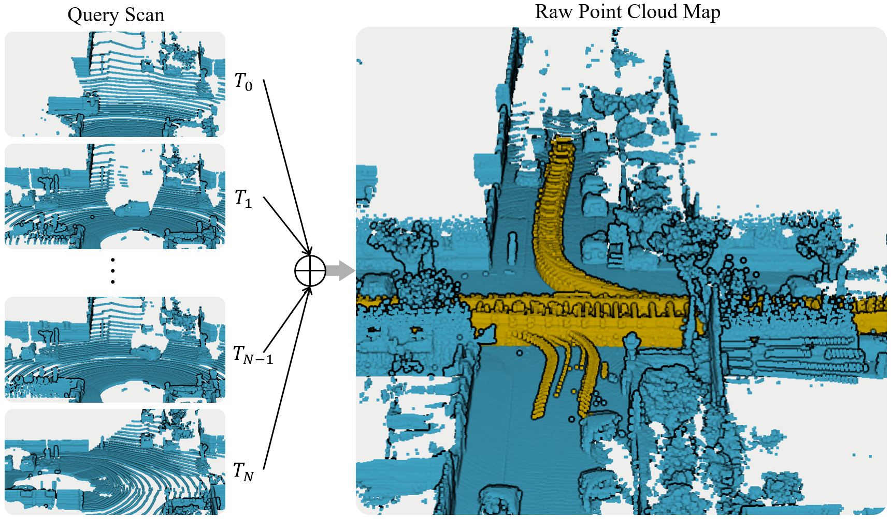

A Dynamic Points Removal Benchmark in Point Cloud Maps
---

<!-- [](https://paperswithcode.com/sota/dynamic-point-removal-on-semi-indoor?p=a-dynamic-points-removal-benchmark-in-point) -->
[](https://arxiv.org/abs/2307.07260) 
[](https://www.bilibili.com/video/BV1bC4y1R7h3)
[](https://youtu.be/pCHsNKXDJQM?si=nhbAnPrbaZJEqbjx)
[](https://hkustconnect-my.sharepoint.com/:b:/g/personal/qzhangcb_connect_ust_hk/EQvNHf9JNEtNpyPg1kkNLNABk0v1TgGyaM_OyCEVuID4RQ?e=TdWzAq)
[](https://kth-rpl.github.io/DynamicMap_Benchmark/)
[](https://zhuanlan.zhihu.com/p/662096274) 

Here is a preview of the readme in codes. Task detects dynamic points in maps and removes them, enhancing the maps:

<center>

</center>

**Folder** quick view:

- `methods` : contains all the methods in the benchmark
- `scripts/py/eval`: eval the result pcd compared with ground truth, get quantitative table
- `scripts/py/data` : pre-process data before benchmark. We also directly provided all the dataset we tested in the map. We run this benchmark offline in computer, so we will extract only pcd files from custom rosbag/other data format [KITTI, Argoverse2]

**Quick** try:

- Teaser data on KITTI sequence 00 only 384.8MB in [Zenodo online drive](https://zenodo.org/record/10886629)
  ```bash
  wget https://zenodo.org/records/10886629/files/00.zip
  unzip 00.zip -d ${data_path, e.g. /home/kin/data}
  ```
- Clone our repo (if it's slow to clone all, check our github page and select one of methods and go to the next step)
  ```bash
  git clone --recurse-submodules https://github.com/KTH-RPL/DynamicMap_Benchmark.git
  ```
- Go to methods folder, run through 
  ```bash
  cd methods/dufomap && pip install dufomap
  python main.py --data_dir ${data_path, e.g. /home/kin/data/00}
  ```

📓 Visit [our wiki page](https://kth-rpl.github.io/DynamicMap_Benchmark/) for detailed tutorials and updates.

### News: 

Feel free to pull a request if you want to add more methods or datasets. Welcome! We will try our best to update methods and datasets in this benchmark. 
Please give us a star 🌟 and cite our work 📖 if you find this useful for your research. Thanks!

- **2024/08/24** We have [wiki page](https://kth-rpl.github.io/DynamicMap_Benchmark/) now! It mainly explains benchmark codes and data format from scratch in more detail. Additionally, it includes how to automatically output tables, pictures, and videos in our papers.
- **2024/04/29** [BeautyMap](https://arxiv.org/abs/2405.07283) is accepted by RA-L'24. Updated benchmark: BeautyMap and DeFlow submodule instruction in the benchmark. Added the first data-driven method [DeFlow](https://github.com/KTH-RPL/DeFlow/tree/feature/dynamicmap) into our benchmark. Feel free to check. And [a discussion](https://github.com/KTH-RPL/DynamicMap_Benchmark/discussions/15) for why metric different than previous works.
- **2024/04/18** [DUFOMap](https://arxiv.org/abs/2403.01449) is accepted by RA-L'24. Updated benchmark: DUFOMap and dynablox submodule instruction in the benchmark. Two datasets w/o gt for demo are added in the download link. Feel free to check.
- **2024/03/08** **Fix statements** on our ITSC'23 paper: KITTI sequences pose are also from SemanticKITTI which used SuMa. In the DUFOMap paper Section V-C, Table III, we present the dynamic removal result on different pose sources. Check discussion in [DUFOMap](https://arxiv.org/abs/2403.01449) paper if you are interested.
- **2023/06/13** The [benchmark paper](https://arxiv.org/abs/2307.07260) Accepted by ITSC 2023 and release five methods (Octomap, Octomap w GF, ERASOR, Removert) and three datasets (01, 05, av2, semindoor) in [benchmark paper](https://arxiv.org/abs/2307.07260).


## Methods:

Please check in [`methods`](methods) folder.

Online (w/o prior map):
- [x] DUFOMap (Ours 🚀): [RAL'24](https://arxiv.org/abs/2403.01449), [**Benchmark Instruction**](https://github.com/KTH-RPL/dufomap)
- [x] Octomap w GF (Ours 🚀): [ITSC'23](https://arxiv.org/abs/2307.07260), [**Benchmark improvement ITSC 2023**](https://github.com/Kin-Zhang/octomap/tree/feat/benchmark)
- [x] dynablox: [RAL'23 official link](https://github.com/ethz-asl/dynablox), [**Benchmark Adaptation**](https://github.com/Kin-Zhang/dynablox/tree/feature/benchmark) 
- [x] Octomap: [ICRA'10 & AR'13 official link](https://github.com/OctoMap/octomap_mapping), [**Benchmark implementation**](https://github.com/Kin-Zhang/octomap/tree/feat/benchmark)

Learning-based (data-driven) (w pretrain-weights provided):
- [x] DeFlow (Ours 🚀): [ICRA'24](https://arxiv.org/abs/2401.16122), [**Benchmark Adaptation**](https://github.com/KTH-RPL/DeFlow/tree/feature/dynamicmap)

Offline (need prior map).
- [x] BeautyMap (Ours 🚀): [RAL'24](https://arxiv.org/abs/2405.07283), [**Official Code**](https://github.com/MKJia/BeautyMap)
- [x] ERASOR: [RAL'21 official link](https://github.com/LimHyungTae/ERASOR), [**benchmark implementation**](https://github.com/Kin-Zhang/ERASOR/tree/feat/no_ros)
- [x] Removert: [IROS 2020 official link](https://github.com/irapkaist/removert), [**benchmark implementation**](https://github.com/Kin-Zhang/removert)

Please note that we provided the comparison methods also but modified a little bit for us to run the experiments quickly, but no modified on their methods' core. Please check the LICENSE of each method in their official link before using it.

You will find all methods in this benchmark under `methods` folder. So that you can easily reproduce the experiments. [Or click here to check our score screenshot directly](assets/imgs/eval_demo.png). 
<!-- And we will also directly provide [the result data](TODO) so that you don't need to run the experiments by yourself. ... Where to save this?  -->

Last but not least, feel free to pull request if you want to add more methods. Welcome!

## Dataset & Scripts

Download PCD files mentioned in paper from [Zenodo online drive](https://zenodo.org/records/10886629). Or create unified format by yourself through the [scripts we provided](scripts/README.md) for more open-data or your own dataset. Please follow the LICENSE of each dataset before using it.

- [x] [Semantic-Kitti, outdoor small town](https://semantic-kitti.org/dataset.html) VLP-64
- [x] [Argoverse2.0, outdoor US cities](https://www.argoverse.org/av2.html#lidar-link) VLP-32
- [x] [UDI-Plane] Our own dataset, Collected by VLP-16 in a small vehicle.
- [x] [KTH-Campuse] Our [Multi-Campus Dataset](https://mcdviral.github.io/), Collected by [Leica RTC360 3D Laser Scan](https://leica-geosystems.com/products/laser-scanners/scanners/leica-rtc360). Only 18 frames included to download for demo, please check [the official website](https://mcdviral.github.io/) for more.
- [x] [Indoor-Floor] Our own dataset, Collected by Livox mid-360 in a quadruped robot.

Welcome to contribute your dataset with ground truth to the community through pull request.

### Evaluation

First all the methods will output the clean map, if you are only **user on map clean task,** it's **enough**. But for evaluation, we need to extract the ground truth label from gt label based on clean map. Why we need this? Since maybe some methods downsample in their pipeline, we need to extract the gt label from the downsampled map.

Check [create dataset readme part](scripts/README.md#evaluation) in the scripts folder to get more information. But you can directly download the dataset through the link we provided. Then no need to read the creation; just use the data you downloaded.

- Visualize the result pcd files in [CloudCompare](https://www.danielgm.net/cc/) or the script to provide, one click to get all evaluation benchmarks and comparison images like paper have check in [scripts/py/eval](scripts/py/eval).

- All color bar also provided in CloudCompare, here is [tutorial how we make the animation video](TODO).

## Acknowledgements

This benchmark implementation is based on codes from several repositories as we mentioned in the beginning. Thanks for these authors who kindly open-sourcing their work to the community. Please see our paper reference section to get more information.

Thanks to HKUST Ramlab's members: Bowen Yang, Lu Gan, Mingkai Tang, and Yingbing Chen, who help collect additional datasets.

This work was partially supported by the Wallenberg AI, Autonomous Systems and Software Program ([WASP](https://wasp-sweden.org/)) funded by the Knut and Alice Wallenberg Foundation

### Cite Our Papers

Please cite our works if you find these useful for your research:

```
@inproceedings{zhang2023benchmark,
  author={Zhang, Qingwen and Duberg, Daniel and Geng, Ruoyu and Jia, Mingkai and Wang, Lujia and Jensfelt, Patric},
  booktitle={IEEE 26th International Conference on Intelligent Transportation Systems (ITSC)}, 
  title={A Dynamic Points Removal Benchmark in Point Cloud Maps}, 
  year={2023},
  pages={608-614},
  doi={10.1109/ITSC57777.2023.10422094}
}
@article{jia2024beautymap,
  author={Jia, Mingkai and Zhang, Qingwen and Yang, Bowen and Wu, Jin and Liu, Ming and Jensfelt, Patric},
  journal={IEEE Robotics and Automation Letters}, 
  title={{BeautyMap}: Binary-Encoded Adaptable Ground Matrix for Dynamic Points Removal in Global Maps}, 
  year={2024},
  volume={9},
  number={7},
  pages={6256-6263},
  doi={10.1109/LRA.2024.3402625}
}
@article{daniel2024dufomap,
  author={Duberg, Daniel and Zhang, Qingwen and Jia, Mingkai and Jensfelt, Patric},
  journal={IEEE Robotics and Automation Letters}, 
  title={{DUFOMap}: Efficient Dynamic Awareness Mapping}, 
  year={2024},
  volume={9},
  number={6},
  pages={5038-5045},
  doi={10.1109/LRA.2024.3387658}
}
```
