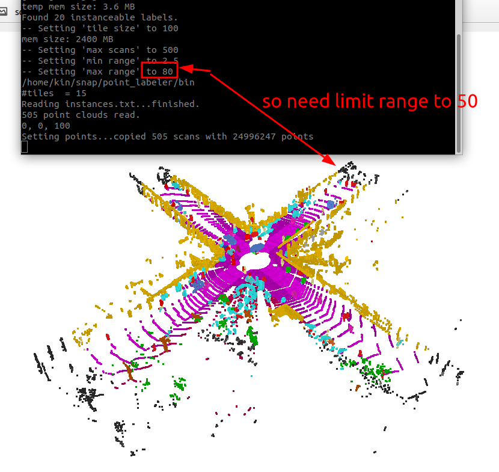

# Data

In this section, we will introduce the data format we use in the benchmark, and how to prepare the data (public datasets or collected by ourselves) for the benchmark.

## Format

We saved all our data into PCD files, first let me introduce the [PCD file format](https://pointclouds.org/documentation/tutorials/pcd_file_format.html):

The important two for us are `VIEWPOINT`, `POINTS` and `DATA`:

- **VIEWPOINT** - specifies an acquisition viewpoint for the points in the dataset. This could potentially be later on used for building transforms between different coordinate systems, or for aiding with features such as surface normals, that need a consistent orientation.

    The viewpoint information is specified as a translation (tx ty tz) + quaternion (qw qx qy qz). The default value is:

    ```bash
    VIEWPOINT 0 0 0 1 0 0 0
    ```

- **POINTS** - specifies the number of points in the dataset.

- **DATA** - specifies the data type that the point cloud data is stored in. As of version 0.7, three data types are supported: ascii, binary, and binary_compressed. We saved as binary for faster reading and writing.

### Example

```
# .PCD v0.7 - Point Cloud Data file format
VERSION 0.7
FIELDS x y z intensity
SIZE 4 4 4 4
TYPE F F F F
COUNT 1 1 1 1
WIDTH 125883
HEIGHT 1
VIEWPOINT -15.6504 17.981 -0.934952 0.882959 -0.0239536 -0.0058903 -0.468802
POINTS 125883
DATA binary
```

In this `004390.pcd` we have 125883 points, and the pose (sensor center) of this frame is: `-15.6504 17.981 -0.934952 0.882959 -0.0239536 -0.0058903 -0.468802`. All points are already transformed to the world frame.

## Download benchmark data

We already processed the data in the benchmark, you can download the data from the [following links](https://zenodo.org/records/10886629):


| Dataset | Description | Sensor Type | Total Frame Number | Size |
| --- | --- | --- | --- | --- |
| KITTI sequence 00 | in a small town with few dynamics (including one pedestrian around) | VLP-64 | 141 | 384.8 MB |
| KITTI sequence 05 | in a small town straight way, one higher car, the benchmarking paper cover image from this sequence. | VLP-64 | 321 | 864.0 MB |
| Argoverse2 | in a big city, crowded and tall buildings (including cyclists, vehicles, people walking near the building etc. | 2 x VLP-32 | 575 | 1.3 GB |
| KTH campus (no gt) | Collected by us (Thien-Minh) on the KTH campus. Lots of people move around on the campus. | Leica RTC360 | 18 | 256.4 MB |
| Semi-indoor | Collected by us, running on a small 1x2 vehicle with two people walking around the platform. | VLP-16 | 960 | 620.8 MB |
| Twofloor (no gt) | Collected by us (Bowen Yang) in a quadruped robot. A two-floor structure environment with one pedestrian around. | Livox-mid 360 | 3305 | 725.1 MB |

Download command:
```bash
wget https://zenodo.org/api/records/10886629/files-archive.zip

# or download each sequence separately
wget https://zenodo.org/records/10886629/files/00.zip
wget https://zenodo.org/records/10886629/files/05.zip
wget https://zenodo.org/records/10886629/files/av2.zip
wget https://zenodo.org/records/10886629/files/kthcampus.zip
wget https://zenodo.org/records/10886629/files/semindoor.zip
wget https://zenodo.org/records/10886629/files/twofloor.zip
```

## Create by yourself

If you want to process more data, you can follow the instructions below. (
    
!!! Note
    Feel free to skip this section if you only want to use the benchmark data.    

### Custom Data

For our custom dataset, we normally record the pointcloud with rosbag, and then running some slam methods to get the pose. If you don't have clue to use the slam package, check [simple_ndt_slam](https://github.com/Kin-Zhang/simple_ndt_slam) repo the only dependence you need in the repo is ROS. If you don't have ROS/Ubuntu, you can directly use the `docker` to run.

Then, directly export rosbag file [which have pose/tf and pointcloud topic] to pcd we want, after your run with [`simple_ndt_slam`](https://github.com/Kin-Zhang/simple_ndt_slam) check your result rosbag file by `rosbag info`, here is example output:

```
➜  bags rosbag info res_semi_indoor_data.bag
path:        res_semi_indoor_data.bag
version:     2.0
duration:    1:47s (107s)
start:       Apr 28 2023 11:11:26.79 (1682673086.79)
end:         Apr 28 2023 11:13:14.35 (1682673194.35)
size:        810.8 MB
messages:    4803
compression: none [961/961 chunks]
types:       nav_msgs/Odometry       [cd5e73d190d741a2f92e81eda573aca7]
             sensor_msgs/PointCloud2 [1158d486dd51d683ce2f1be655c3c181]
             tf2_msgs/TFMessage      [94810edda583a504dfda3829e70d7eec]
topics:      /auto_odom       960 msgs    : nav_msgs/Odometry      
             /repub_points    960 msgs    : sensor_msgs/PointCloud2
             /tf             2883 msgs    : tf2_msgs/TFMessage

```

Then use the scripts I provided in [`simple_ndt_slam`](https://github.com/Kin-Zhang/simple_ndt_slam) to extract the pcd data to unified format here.

```bash
roscore # since need read rosbag through scripts

./simple_ndt_slam/tools/build/bag2pcd_tf /home/kin/bags/res_semi_indoor_data.bag /home/kin/data/semindoor /repub_points map 1 # 1 for save raw map also since some methods need use it in the framework.
```

### KITTI Dataset

Official data format [Download link](http://www.semantic-kitti.org/dataset.html#download)

#### Extract Point Cloud Data

extract the semantic-kitti dataset from the raw data, when you download the original SemanticKITTI dataset, you will get a folder like this:
```
➜  SemanticKitti tree -L 2
.
├── data_odometry_calib
│   └── dataset
│       └── sequences
├── data_odometry_labels
│   ├── dataset
│   │   └── sequences
│   └── README
├── data_odometry_velodyne
│   └── dataset
│       └── sequences
```

After downloading the official dataset, Run the script like follows:
```
python3 scripts/data/extract_semkitti.py --original_path /home/kin/data/KITTI/SemanticKitti --save_data_folder /home/kin/data/DynamicMap --gt_cloud True --sequence "'00'" 
```

Note!! 

1. SemanticKITTI pose file is not ground truth pose but run SuMa, more discussion and different can be found here in [semantic-kitti-api/issues/140](https://github.com/PRBonn/semantic-kitti-api/issues/140). We have extra different odometry pose result in [DUFOMap paper, Sec V-C, Table III](https://arxiv.org/pdf/2403.01449), based on [scripts/py/data/extract_diff_pose.py](py/data/extract_diff_pose.py)

2. You can get the sensor pose in the PCD `VIEWPOINT` Field, so you don't need pose file etc. 
   If you are using CloudCompare to view, drag all pcd files to windows, you will have the correct whole map view. 
   (NOTE Since we already transform to world frame CloudCompare in 2.11 version will looks correct map 
   but version to 2.12+ will have double effect on VIEWPOINT Field [you can comment the transform line if you don't like that.] )
	
	Example here:
	

3. View the ground truth in CloudCompare, intensity=1 means dynamic which are red points in images:

    

4. 2024/03/27 Updated version limit the range because we find the ground truth label is not correct in the far range, so we limit the range to 50m. You can change the range in the script.
   
    

<!-- 5. Tracking seq 19, the original pose I cannot parse as previous semantickitti dataset, so I run kiss_icp_pipeline to get new pose file. Replace the original pose file with the new one. And tracking seq 19 gt label max range looks like 40m since I check 50m sitll have some mislabel pedestrians. -->


### Argoverse 2.0 Dataset

I manually labeled dynamic and static in one sequence folder name: `07YOTznatmYypvQYpzviEcU3yGPsyaGg__Spring_2020` , you have to go for website to downloaded this ground truth PCD.

#### Download

Check this issue: https://github.com/argoverse/av2-api/issues/161

Installing s5cmd

```bash
#!/usr/bin/env bash

export INSTALL_DIR=$HOME/.local/bin
export PATH=$PATH:$INSTALL_DIR
export S5CMD_URI=https://github.com/peak/s5cmd/releases/download/v1.4.0/s5cmd_1.4.0_$(uname | sed 's/Darwin/macOS/g')-64bit.tar.gz

mkdir -p $INSTALL_DIR
curl -sL $S5CMD_URI | tar -C $INSTALL_DIR -xvzf - s5cmd
```

Download the val dataset since train is toooo big for me, totally is 5T for train dataset although no label.

```bash
s5cmd --no-sign-request cp 's3://argoai-argoverse/av2/lidar/val/*' /home/kin/bags/av2/val
```

#### Extract Point Cloud Data

This time no need cpp file since argoverse have their own api things and we just need to use it. Also I write with save pcd in utils.

Check their [python api](https://pypi.org/project/av2/), [github](https://github.com/argoverse/av2-api)
```bash
pip install av2
```

Please check the folder path inside the script.
```bash
python3 scripts/extract_argoverse2.py
```

