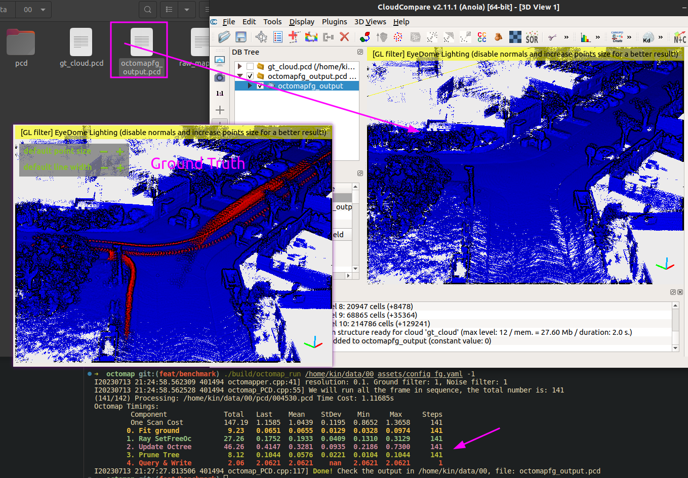
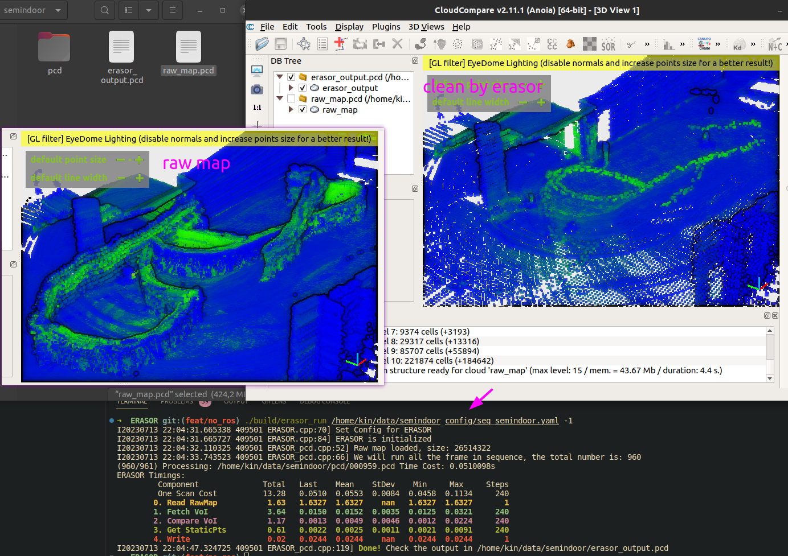

Methods in Benchmark
---

Please visit 📓[our wiki page](https://kth-rpl.github.io/DynamicMap_Benchmark/) for detailed tutorials and the latest updates documentation.

Demo Image, results you can have after reading this README:



All of them have same dependencies [PCL, Glog, yaml-cpp], we will show how to install and build:

## Install & Build

Test computer and System:

- Desktop setting: i9-12900KF, 64GB RAM, Swap 90GB, 1TB SSD
- System setting: Ubuntu 20.04 [ROS noetic-full installed in system]

Dependencies listed following if you want to install them manually, or you can use docker to build and run if you don't like trash your env.

### Docker
If you want to use docker, please check [Dockerfile](../Dockerfile) for more details.  This can also be a reference for you to install the dependencies.
```
cd DynamicMap_Benchmark
docker build -t zhangkin/dynamic_map .
docker run -it --rm --name dynamicmap -v /home/kin/data:/home/kin/data zhangkin/dynamic_map /bin/zsh
```
- `-v` means link your data folder to docker container, so you can use your data in docker container. `-v ${your_env_path}:${container_path}`
- If it's hard to build, you can always use `docker pull zhangkin/dynamic_map` to pull the image from docker hub.


### PCL
Normally, you will directly have PCL and OpenCV library if you installed ROS-full in your computer. Otherwise

```sh
sudo apt update && sudo apt install -y libpcl-dev 
```

### glog gflag [for print]

You can install them manually or use the script to install them.
```sh
# option 1:
sudo apt install -y libgoogle-glog-dev libgflags-dev

# option 2:
sh -c "$(wget -O- https://raw.githubusercontent.com/Kin-Zhang/Kin-Zhang/main/Dockerfiles/latest_glog_gflag.sh)"
```

### Build

```bash
cd ${methods you want}
cmake -B build && cmake --build build
```

## RUN

Check each methods config file in their own folder `config/*.yaml` or `assets/*.yaml`
```bash
./build/${methods_name}_run ${data_path} ${config.yaml/toml} -1
```

For example, if you want to run octomap with GF

```bash
./build/octomap_run /home/kin/data/00 assets/config_fg.toml -1
```

Then you can get a time table with clean map result from Octomap w GF like top image shows.

 <!-- Or ERASOR on semindoor dataset:

```bash
./build/erasor_run /home/kin/data/semindoor config/seq_semindoor.yaml -1
```

 -->
All Running commands, `-1` means all pcd files in the `pcd` folder, otherwise the default is `10`/`1` frames.

```
./build/octomap_run ${data_path} ${config.toml} -1
python BeautyMap/main.py --data_dir ${data_path} --run_file_num -1
./build/dufomap_run ${data_path} ${config.toml}
```

<!-- ./build/removert_run ${data_path} ${config.yaml} -1
./build/erasor_run ${data_path} ${config.yaml} -1 -->

## Quick view on results

Both with quantitative table and qualitative result

- Quantitative result print out the table: [scripts/py/eval/evaluate_all.py](../scripts/py/eval/evaluate_all.py)
- Qualitative result automatically compare and merge: [scripts/py/eval/figure_plot.ipynb](../scripts/py/eval/figure_plot.ipynb)
